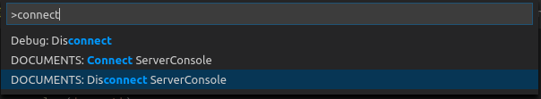

## Changelog

You'll find a complete list of changes at our project site on [GitHub](https://github.com/otris/vscode-janus-debug).

### 0.0.36 (2018-04-13)
 
- The command **Show Imports** shows the source code of the script and additional the source code of all scripts that are included with `#include`. Now this source code is shown in an untitled file with JavaScript Syntax Highlighting.
- When conflict mode is used, not only the source code is checked on server, but also the category.
- Server name is shown in output of **Run Script** and **Show DOCUMENTS Version**.

### 0.0.35 (2018-04-12)

- Fix for **Run Script**

### 0.0.34 (2018-04-11)

- Added a new **Upload and Debug Script** command that allows you to debug a script on a DOCUMENTS 5.0d server.
- Added source mapping that allows you to debug a remote script while having the debugger step through your *local* files.

### 0.0.33 (2018-04-10)

- Check added in **Upload Scripts from Folder**: if the folder contains two scripts with same name, a warning is shown and the user can cancel the upload. Scripts with same name are not allowed on DOCUMENTS, not even if they are in categories.

### 0.0.32 (2018-03-09)

- [Using Categories as Subfolders](https://github.com/otris/vscode-janus-debug/wiki/Using-Categories-as-Subfolders)
- Some fixes

### 0.0.31 (2018-02-01)

- Improved documentation and typings.
- Wizard to download scripts and create a project containing the downloaded scripts.
- The command **Install IntelliSense: PortalScript** optionally gets the type definition file for PortalScripting in specific DOCUMENTS version. Old versions are generated, newer versions are stored in the extension.

### 0.0.30 (2018-01-18)

- The command **Install IntelliSense** additionally installs the typings for the ScriptExtensions `scriptExtensions.d.ts`. Both files `portalScripting.d.ts` and `scriptExtensions.d.ts` were generated using node module **jsdoc** with template [**@otris/jsdoc-tsd**](https://www.npmjs.com/package/@otris/jsdoc-tsd).

### 0.0.29 (2018-01-12)

Only small changes:
- Server console is not connected on default anymore.
- Some commands have been renamed and are visible more often.

### 0.0.28 (2018-01-12)

Following features have been added:
- Setting `vscode-janus-debug.encryptOnUpload` is deprecated now. Instead `vscode-janus-debug.encryptionOnUpload` should be used. This new setting has three possible values.
  - `"default"`: the script will be encrypted on upload, if it is encrypted on server or conains `// #crypt`
  - `"always"`: the script will be encrypted on upload in any case
  - `"never"`: the script will be kept unencrypted on upload in any case

### 0.0.27 (2017-12-18)

Following features have been added:
- Command **Download Scripts Inside Folder** was added. With this command, only the scripts that are already inside the folder, are downloaded.
- Command **Show Imports** was added. This command shows the source code of the script and of all imported scripts in output.
- In the typings file `fileTypes.d.ts` the type definition `FileTypes` was inserted. This type is a union type of all file types.

### 0.0.26 (2017-12-04)

Only clean-up and fix link in command **View Documentation In Browser**.

### 0.0.25 (2017-28-11)

Following bugs have been addressed in this release:

- Debugger: launching scripts on a remote server got exactly 3 seconds faster because we could remove a now unnecessary synchronization point (``).

### 0.0.24 (2017-11-14)

Following features have been added:

- Parameters are uploaded and downloaded together with script, if flag `vscode-janus-debug.scriptParameters` is set (DOCUMENTS 5.0c HF1 required).

Following bugs have been addressed in this release:

- Debugger: fixed creating a new `launch.json` with VS Code 1.18.0. The way how initial configurations where constructed was deprecated with 1.17.0 and removed in 1.18.0, making it impossible to create a `launch.json` file in a new project. This works again now (`576daf8`).
- Fix warning showing up on any up- or download

### 0.0.23 (2017-11-08)

Following features and bugs have been addressed in this release:

- Improved fileTypes.d.ts: fields have types now (available in DOCUMENTS 5.0c HF1 or #8044).

- Some improved error messages.

- In command **Compare Script**, the script is not synchronized anymore (hash value of source code is not set, so changes on server will still be recognized on next upload after **Compare Script**).

- Fix stopOnEntry in debugger.

### 0.0.22 (2017-10-20)

New Features in this release:

- Tho command *Show Documentation In Browser* was improved.

### 0.0.21 (2017-10-06)

New Features in this release:

- IntelliSense for parameter values in `setFieldValue` and `getFieldValue` is available (with ctrl + space inside quotes).

- IntelliSense for adding jsDoc with `@types{}` was added to variables.

- `class util` and functions `convertDateToString` and `convertStringToDate` was added to command **View Documentation In Browser**.

- Command **Download Script** in explorer context menu is available in workspace folder.

- Command **Show DOCUMENTS Version** inserted.

Following bugs have been addressed in this release:

- Create `launch.json` in empty project has been fixed.

- *Install Intellisense: FileTypes* in empty project has been fixed.

### 0.0.20 (2017-10-06)

### 0.0.19 (2017-10-06)

### 0.0.18 (2017-10-04)

New Features in this release:

- **View Documentation In Browser** works for `class context`.

Following bugs have been addressed in this release:

- Credentials are asked, if the `launch.json` doesn't contain a ``currentConfiguration`` flag, even if only one configuration was available.

- `launch.json` was overwritten after entering the credentials.

### 0.0.17 (2017-10-02)

New Features in this release:

- The DOCUMENTS version is written to script console on every run.

- The script returnValue can now be written to a file. Just `vscode-janus-debug.scriptLog.fileName` and `vscode-janus-debug.scriptLog.returnValue` have to be set.

- Remove `noLib: true` entry in `jsconfig.json`.

Following bugs have been addressed in this release:

- Change password didn't work correctly when password was not written to launch.json.

### 0.0.16 (2017-09-27)

Fix run active script.

### 0.0.15 (2017-09-27)

New Features in this release:

- IntelliSense for file types (beta version). Use command **Get fileTypes.d.ts** and make sure you have a valid `jsconfig.json`. Then you will get IntelliSense for file types by using `context.createFile(" <Ctrl + Space + choose suggenstion> ")` or by adding `/** @types{FileType} */` to DocFile objects.
- For commands **Run Script** and **Download Script** it is now possible to choose the script from a list of available scripts on server.

Following bugs have been addressed in this release:

- **Upload All** works again, if the folders contain files that are not JavaScript files.

### 0.0.14 (2017-09-22)

### 0.0.13 (2017-09-22)

Only one fix. It's now possible again to upload scripts without checking them on server by setting `vscode-janus-debug.forceUpload` to `true`.

### 0.0.12 (2017-09-19)

Only fix error `Cannot write to settings.json`

### 0.0.11 (2017-09-19)

New Features in this release:

- The conflict mode is now the default state of all scripts, meaning every script will be checked on upload if it has been changed on server.

- Add ``noLib: true`` to ``compilerOptions`` part in ``jsconfig.json`` when command **Install Intellisense Files** is executed.

- TypeScript 2.5 is now used to generate JavaScript.

- The version of the remote debugging engine is now logged in the VS Code extension's log files. This way we can see what version of debugging engine the Debugger is running against.

- It's possible now to have multiple configurations for different servers in ``jsconfig.json``. The extension will use the configuration where ``currentConfiguration`` is set to ``true`` for uploading and downloading scripts.

- **Get Script Paramaters** downloads the script parameters as JSON string into one file per script.

Following bugs have been addressed in this release:

- Download all to workspace root folder is now possible again.

### 0.0.10 (2017-08-22)

New Features in this release:

 - Users can now use keyboard shortcuts for uploading, running, uploading and running, and uploading from ts to js ([#84](https://github.com/otris/vscode-janus-debug/issues/84)).

 - The command `Upload Scripts From Folder` will upload scripts from folder and all subfolders ([#72](https://github.com/otris/vscode-janus-debug/issues/72)).

 - Flag `vscode-janus-debug.uploadOnSaveGlobal` will be saved in **User Settings**.

Following bugs have been addressed in this release:
 - The server console was not reconnecting after the launch.json was changed ([#103](https://github.com/otris/vscode-janus-debug/issues/103)).
 - Answer `Never upload automatcally` in dialog after saving `.js` file didn't work corryctly.

### 0.0.9 (2017-07-19)

New Features:

- Users can connect and disconnect the ServerConsole using the command palette now. Two new commands have been added: _Connect ServerConsole_ and _Disconnect ServerConsole_ ([#48](https://github.com/otris/vscode-janus-debug/issues/48)).

- And one for the hackers: File logging is now additionally available in the extension process of VS Code and not only in the debug adapter process. To activate this feature you have to add `"vscode-janus-debug.log"` to your settings ([#30](https://github.com/otris/vscode-janus-debug/issues/30)).

- The configuration name for the extension settings in `settings.json` is now `"vscode-janus-debug"` instead of `"vscode-documents-scripting"`. The user has to change the name for any list in `settings.json`.

- Command for installing IntelliSense files.

- The debugger can now "Step Out" (Shift+F11) of a function. Just make sure you have the latest DOCUMENTS/JANUS server running ([#68](https://github.com/otris/vscode-janus-debug/issues/68)). Thanks [@PhilippRo](https://github.com/PhilippRo).

Fixes in this release:

- Fix problems with encrypted scripts again. It's not possible anymore to upload or download encrypted scripts. Scripts can only be encrypted on upload or decrypted on download. ([#64](https://github.com/otris/vscode-janus-debug/issues/64))

- Fix upload script via command palette. Now the extension will ask for the scriptname again, if upload script is called while another script is open in VS Code.

### 0.0.8 (2017-07-07)

New Features:

- Users can now write DOCUMENTS scripts in [TypeScript](https://www.typescriptlang.org/) and then use the command `Upload JS from TS` to compile the TypeScript file and upload the corresponding JavaScript ([#55](https://github.com/otris/vscode-janus-debug/issues/55)).
- Users can now download a script from the server via the context menu when using right-click on a folder.
- Users will be asked before passwords will be written in plain-text to the project's `launch.json` file.
- The extension comes with a lovely icon now 👊 ([#31](https://github.com/otris/vscode-janus-debug/issues/31)).

Following issues have been fixed in this release:

  - The debugger stops now immediately when a breakpoint is hit or the script halts ([#57](https://github.com/otris/vscode-janus-debug/issues/57)).
  - The version and commit number are now printed out on the console when the extension is activated ([#39](https://github.com/otris/vscode-janus-debug/issues/39)).
  - Users can now change all network related timeouts from within `launch.json` file ([#51](https://github.com/otris/vscode-janus-debug/issues/51)). Previously, not all timeouts where configurable.
  - Some minor errors have been fixed when a new `launch.json` is created when the user uploads a script the first time. ([5c45fa0](https://github.com/otris/vscode-janus-debug/commit/5c45fa0ee06c19ca2b1f1641cdce89e200175c16)).

### 0.0.7 (2017-07-07)

Accidentally released.

### 0.0.6 (2017-06-21)

Besides the usual minor fixes and corrections, this release adds the new Server Console output. This allows you to see the server's log lines directly in VS Code! (For more info, see this PR: [#47](https://github.com/otris/vscode-janus-debug/pull/47)).

### 0.0.5 (2017-06-02)

Most notable in this release: We have merged _vscode-documents-scripting_ and _vscode-janus-debug_ extensions into one single extension. Users do not need to install multiple extensions anymore to get the full experience. We hope that this makes development much easier and faster.

Lots of bugs have been fixed in this release:

  - Setting breakpoints is more reliable now ([#12](https://github.com/otris/vscode-janus-debug/issues/12)). Thanks to [ChDxterWard](https://github.com/ChDxterWard).
  - Fixed problems with encrypted and decrypted scripts. The encryption states are now read from DOCUMENTS server prior to every upload. The `// #crypt` entry in a script should work now as expected.
  - Fixed an issue that prevented connecting the debugger to a DOCUMENTS 5 server ([#23](https://github.com/otris/vscode-janus-debug/issues/23)). Sorry!

### 0.0.4 (2017-05-17)

This release includes two important bug fixes that make creating a launch.json file and connecting to a remote server much more reliable.

### 0.0.3 (2017-05-08)

No big changes. Timeouts are configurable via launch.json now.

### 0.0.2 (2017-03-22)

Initial release of the extension. Running and debugging simple scripts directly from within VS Code on a JANUS-based server works! 🎉

