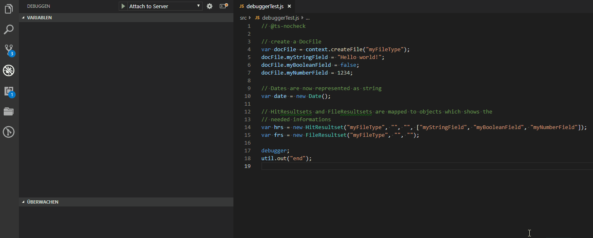
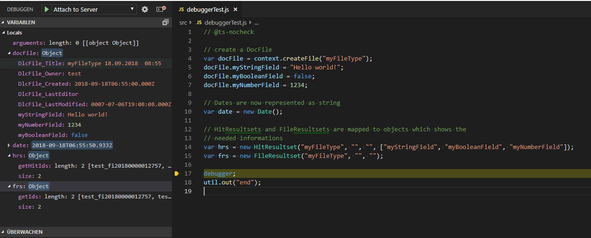

# vscode-janus-debug

[](https://travis-ci.org/otris/vscode-janus-debug)

Visual Studio Code plugin for developing and debugging JavaScript on DOCUMENTS 5.0.

## Features

### Debugger

See also in Wiki [Launching the Debugger](https://github.com/otris/vscode-janus-debug/wiki/Launching-the-Debugger)

This extension allows you to debug portal scripts on a DOCUMENTS 5 server. This includes

* launching a script from within VS Code and executing it remotely on the server
* attaching to a script that is already running on server (and contains the `debugger;` statement)
* setting breakpoints
* stepping through the code
* watching values in the **WATCH** section of the VS Code Debug View (e.g. function return values and also script parameters):



* or viewing some important variable types from portal scripting in the **VARIABLES** section of the VS Code Debug View:



<br>
<br>

The extension includes lots of additional features that ease the development, especially on DOCUMENTS 5.

### Commands

The following commands are supported.

| **Command** | **Description** |
| --- | --- |
| **Uploading/Downloading Scripts** ||
| Upload Script | Upload a script to the server |
| Upload Scripts from Folder | Upload all scripts of a folder and all subfolders to the server |
| Download Script | Download a script from the server. |
| Download All Scripts | Download all scripts from the server to a folder |
| Reload Scripts | If you have a folder that only contains a subset of your server scripts, then you can download only this set of scripts again with this command. The command also recursively dives into subfolders. |
| Compare Script | Compare a script to the script with same name on server |
| **Executing Scripts** ||
| Run Script | Execute a script on server |
| Upload and Run | Upload a script to the server and execute it |
| **Developing Scripts** ||
| Install IntelliSense | Install available Type Definition files and make sure that `jsconfig.json` or `tsconfig.json` exists. After executing this command, you will get IntelliSense completions for PortalScripting while editing your PortalScripts. |
| View Documentation | Open the PortalScript API documentation in a browser. If a browser is set in `vscode-janus-debug.browser` the browser will jump to the documentation of the member or function that is selected by the curser in your editor. |
| **DOCUMENTS Server Information** ||
| Connect Server Console | Show all messages of the DOCUMENTS server in terminal |
| Disconnect Server Console | Stop showing server messages in terminal |
| Show DOCUMENTS Version | Show version of the DOCUMENTS server |

### Settings

The following features can be influenced by settings (in `settings.json`)

**Encryption**
* The setting `vscode-janus-debug.encryptionOnUpload` can be used to control encryption. There are three values.
  * `default`: a script is encrypted on upload, if the corresponding script on server is encrypted or the script source code contains `// #crypt`
  * `always`: scripts are always encrypted on upload.
  * `never`: scripts are never encrypted on upload.

**Script Parameters as JSON**
* Parameters are uploaded and downloaded in a `JSON` file together with every script, if `vscode-janus-debug.scriptParameters = true`

**Conflict Mode**
* A warning with option to cancel is shown on upload, if
  * The source code of the corresponding script has been changed on server
  * The script is encrypted on server and no decryption permission is available
* The warning can be avoided, if
  * `vscode-janus-debug.forceUpload = true`

**View Documentation in Browser**
* This command will jump directly to a function or member, if
  * In `vscode-janus-debug.browser` a browser is selected.

**Server Console**
* Will be connected and disconnected automatically, if setting `autoConnect` in `vscode-janus-debug.serverConsole` is to `true`.

**Script Console**
* By default the Script Console will open, when running a script. To prevent this, you change the setting `openScriptConsoleOnRunScript` to `false`.

**Auto-upload script on save**
* Scripts can be automatically uploaded every time you save the file. The default behavior is, that you will be asked at every time you press `Ctrl + S`, if the script should be uploaded. You can specify scripts that should always or never be uploaded without asking. Or you can switch this feature off by answering `Never upload scripts automatically`. If you want to turn the feature on again later, you only have to set `vscode-janus-debug.uploadOnSaveGlobal` to `true` in your **user** settings.


## Requirements

This extension is only compatible with the JANUS servers listed below. Not every version supports every feature:

| Server version                  	| Up-/downloading / running scripts 	| Remote debugging 	|
|---------------------------------	|-----------------------------------	|------------------	|
| DOCUMENTS 5.0b                  	| X                                 	|                  	|
| DOCUMENTS 5.0c                  	| X                                 	|                 	|
| DOCUMENTS 5.0d                  	| X                                 	| X                	|
| privacy 6.1                     	|                                   	| X                	|

If you suspect compatibility issues with your setup, please report them in the issue section.


## Remote Debugging

If you want to use the remote debugging features you need **at least DOCUMENTS 5.0d**!

Add following line to your server's .ini file to enable the debugging engine:

```
JSDebugger yes
JSDebuggerPort 8089
```

Then restart your server process and make sure that your firewall rules and security groups allow access to TCP port 8089.

## Known Issues

Please have a look at our [issue tracker](https://github.com/otris/vscode-janus-debug/issues) for a complete list of issues.

## Troubleshooting

If something doesn't work, please try to reproduce the issue and file a bug [here](https://github.com/otris/vscode-janus-debug/issues) if it is not already known. Please remember to

- Include the version you are using in the report.
- Tell us which server application you are debugging against and on what OS that server is running.
- Include any logs, if possible.

You'll find the log files in your `${workspaceRoot}` which is usually the folder you opened in VS Code. The log files are plain-text files so that you can inspect them yourself. We do not log password hashes but the log files might contain source code or other data that you may consider sensitive. Please make sure that you are fine with the data contained in the log file before submitting.

You can alter log behavior in the `.vscode/launch.json` file.

```json
"log": {
    "fileName": "${workspaceRoot}/vscode-janus-debug-launch.log",
    "logLevel": {
        "default": "Debug",
    }
}
```

The default log level can be any of `Debug`, `Info`, `Warn`, or `Error`.

## Development
If you want to hack on this VS Code extension start with following recipe:

Fork the repository on our GitHub [project page](https://github.com/otris/vscode-janus-debug) and then

```bash
$ git clone https://github.com/your-user-name/vscode-janus-debug.git  # Clone the forked repo
$ cd vscode-janus-debug/  # Change into the source directory
$ npm i  # Install necessary dependencies
```
Then open the folder in VS Code and you're all set. There are two configurations in the `launch.json` file, one configuration that starts a new instance of VS Code with just our extension installed, the so called Extension Host, the other configuration executes all tests using mocha.

Make sure you read the [contribution guide](https://github.com/otris/vscode-janus-debug/blob/master/CONTRIBUTING.md). Happy hacking!

## Legal Notice
This Visual Studio Code extension is developed by otris software AG and was initially released in March 2017. It is licensed under the MIT License, (see [LICENSE file](LICENSE)).

## About otris software AG
As a software-based data and document management specialist, otris software AG supports company decision-makers in realizing management responsibilities. The solutions from otris software are available for this purpose. They can be used track, control and document all administrative processes completely and with full transparency. otris software is based in Dortmund, Germany.

For more information about otris software AG visit our website [otris.de](https://www.otris.de/) or our Open Source repositories at [github.com/otris](https://github.com/otris).

**Enjoy!**

<sup>1</sup> It uses the [jsrdbg](https://github.com/swojtasiak/jsrdbg) Debug Protocol to attach to a remote server and debug the JavaScript code executed by SpiderMonkey. Check it out if you want to know more.
